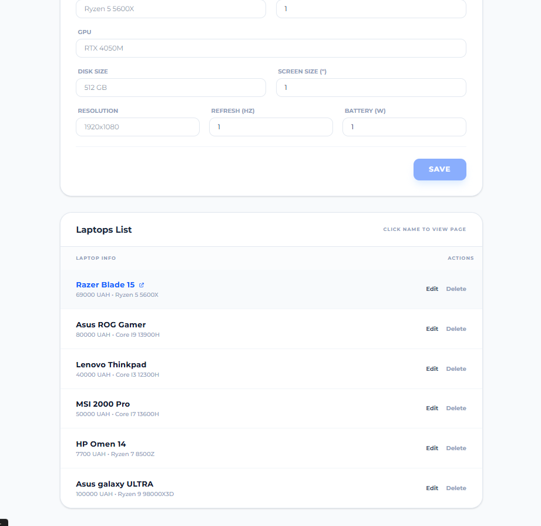
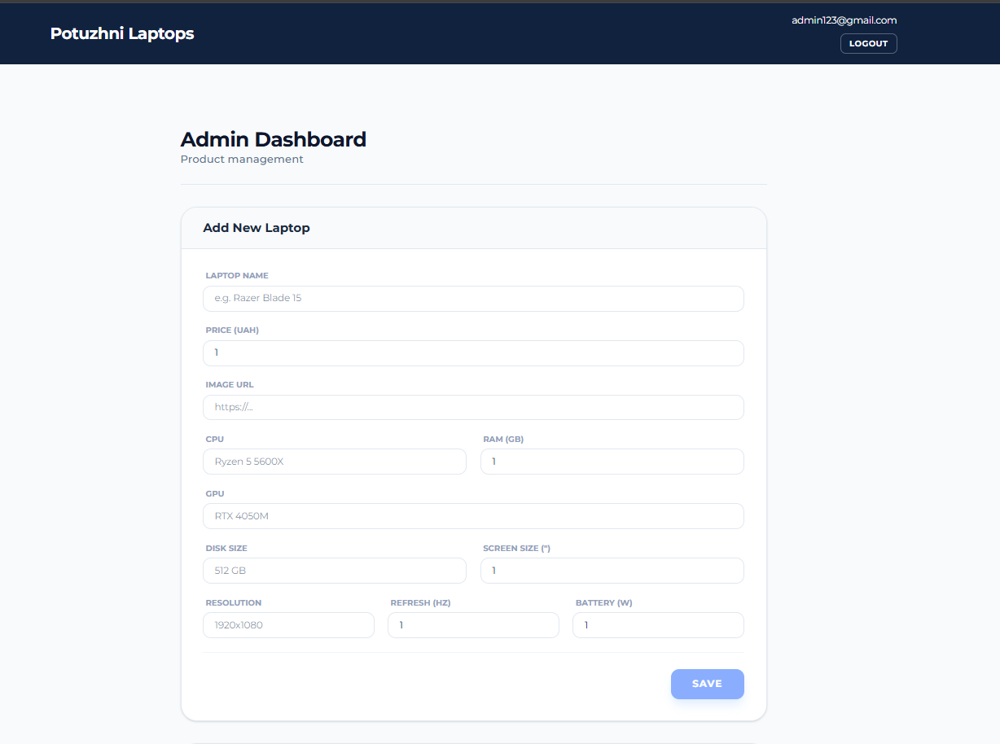
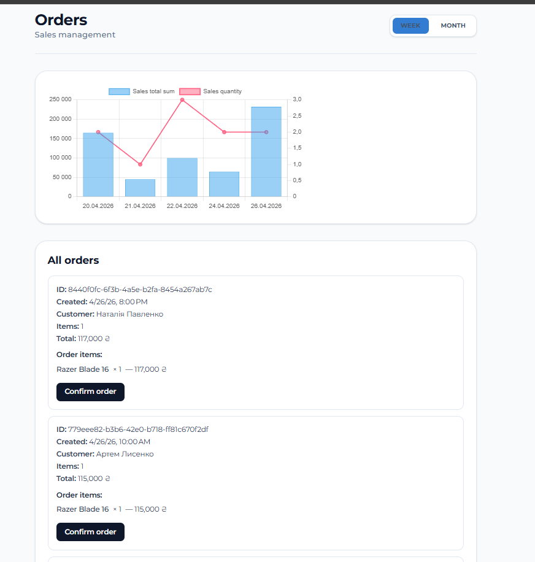

## 💻 Potuzhni Laptops - Full-Stack E-Commerce Platform

E-commerce project built to handle a full-cycle product flow—from catalog browsing and cart management to secure payment processing and automated shipping logistics

This project demonstrates scalable architecture, third-party API integrations, and robust background processing, providing a seamless experience for both end-users and administrators.

## 🔗 Quick Links

**Live demo:** https://potuzhni-laptops-atbmfyb4hafdhyb4.polandcentral-01.azurewebsites.net

**Live scalar:** https://laptopserver-app-20260330234553.agreeableplant-e8507c58.polandcentral.azurecontainerapps.io/scalar

## 🚀 Features

Full-Cycle Shopping Experience: End-to-end user journey including product selection, cart management, and checkout

Secure Authentication: Implemented JWT-based authentication using HttpOnly cookies to ensure maximum security for user sessions

Payment Integration: Integrated Monopay API for processing fast and secure online payments

Advanced Logistics: Deep integration with the Nova Post API for address selection, caching delivery data, and automatic waybill (internet document) generation

Admin Dashboard & Analytics: Dedicated admin panel featuring sales analytics and performance tracking powered by Chart.js.

Asynchronous Order Processing: Utilizes .NET Channels and MediatR for scalable, non-blocking order execution.

Automated Background Tasks: Hosted services handle periodic cart cleanup (`CartCleanerBgService`) and synchronization of Nova Post data (`NpCacheBgService`, `NpInternetDocBgService`).

## 🛠 Tech Stack

**Backend**

*Framework*: ASP.NET Core 10 Web API

*Database & ORM*: SQL Server with Entity Framework Core

*Resilience*: HTTP Client Factory with standard resilience handlers (Polly) for robust external API calls

*Documentation*: Scalar

*Safety*: ASP.NET Core Identity, JWT Bearer Auth

**Frontend**

*Framework*:Angular 21.2.10

*Styling*: Tailwind CSS v4 (utility-first styling approach)

*Charts*: Chart.js for admin analytics dashboards

**Infrastructure**

*Containerization*: Containerized backend using Docker

*Deploy*: Deployed to Microsoft Azure, container app for backend and app service for frontend

**Other**

*MediatR*: Used for decoupling components and implementing the CQRS pattern across the system.

*NET Channels*: Provides a thread-safe, memory-efficient way to queue and process orders asynchronously in the background without holding up HTTP requests.

### 🖼️ Admin panel preview

| Product storage | Product management | Order management |
| :---: | :---: | :---: |
|  |  |  |
